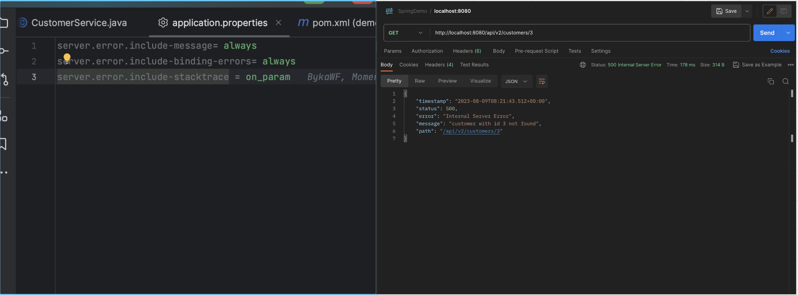
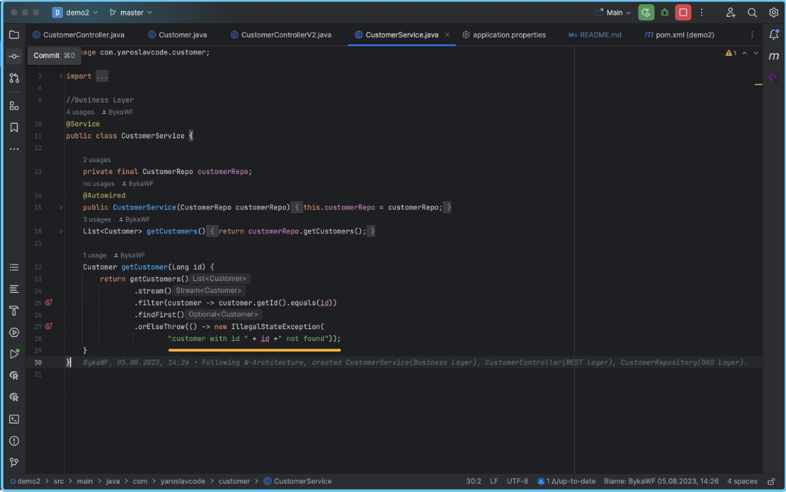
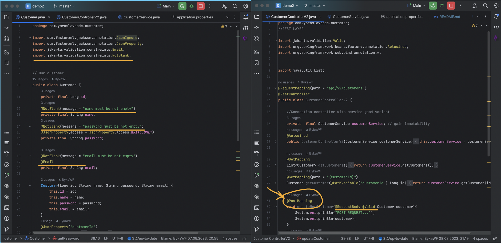
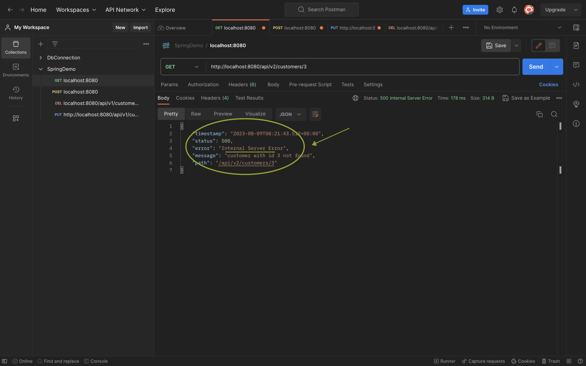
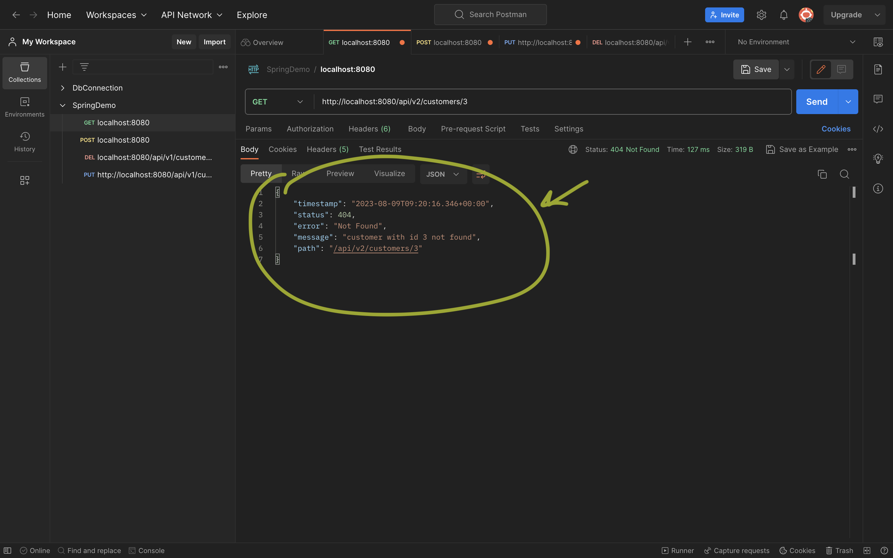

# SpringBootDemo
## Description
It's my CRUD application, you can find a video explanation working of it 👇 

- @GetMapping
How to create the Get request method and how it works: https://youtu.be/fmDG-sWj28I
- @PostMapping
How to create the Post request method and how it works: https://youtu.be/Z9h08E8pDIM
- @DeleteMapping
How to create the Delete request method and how it works: ....soon
- @PutMapping
How to create the Put request method and how it works: https://youtu.be/PhZso8oVSN0


# Links
### HTTP response status codes
- https://developer.mozilla.org/en-US/docs/Web/HTTP/Status

# Tips
- if you want to see your messages about problem in code use application.properties 
```
server.error.include-message= always
server.error.include-binding-errors= always
server.error.include-stacktrace = on_param
```




- if we want to pass our `name` or `email` as a mandatory field help us jakarta.validation library 
Add to you pom.xml file:
```
<dependency>
	<groupId>org.springframework.boot</groupId>
	<artifactId>spring-boot-starter-validation</artifactId>
</dependency>
```


- Sometimes you will get not properly status code
  Create custom exception and implement into business logic.

```
package com.yaroslavcode.exception;

import org.springframework.http.HttpStatus;
import org.springframework.web.bind.annotation.ResponseStatus;

@ResponseStatus(value = HttpStatus.NOT_FOUND)
public class NotFoundException extends RuntimeException{
    public NotFoundException(String message){
        super(message);
    }
}
```

```
package com.yaroslavcode.customer;

import com.yaroslavcode.exception.NotFoundException;
import org.springframework.beans.factory.annotation.Autowired;
import org.springframework.stereotype.Service;
import org.springframework.web.bind.annotation.PathVariable;

import java.util.List;

//Business Layer
@Service
public class CustomerService {

    private final CustomerRepo customerRepo;
    @Autowired
    public CustomerService(CustomerRepo customerRepo){
        this.customerRepo = customerRepo;
    }
    List<Customer> getCustomers() {
        return customerRepo.getCustomers();
    }

    Customer getCustomer(Long id) {
        return getCustomers()
                .stream()
                .filter(customer -> customer.getId().equals(id))
                .findFirst()
                .orElseThrow(() -> new NotFoundException(     <----------------
                        "customer with id " + id +" not found")); 
    }
}

```

